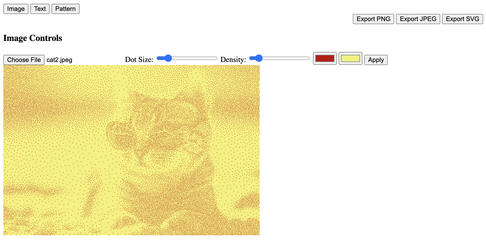

# Dotify: Interactive Dot Art Generator

Dotify is an interactive web application that transforms images, text, and patterns into captivating dot art. It offers users the flexibility to create dot-based designs with various controls, including dot size, density, color, and more. The application provides three main modes: Image Mode, Text Mode, and Pattern Mode, each offering unique features to generate custom dot art. Users can also export their creations in PNG, JPEG, and SVG formats.

## Features

- **Image Mode**: Convert uploaded images into dot art with adjustable dot size, density, and colors.
- **Text Mode**: Turn text input into dot-based typography with control over font size, dot size, and density.
- **Pattern Mode**: Generate abstract dot patterns with adjustable parameters for size, density, and pattern complexity.
- **Export Options**: Save your artwork in PNG, JPEG, and SVG formats.
- **Interactive Controls**: Real-time adjustments for all parameters to fine-tune your art.

## Project screenshots




## Getting Started

### Prerequisites

- A modern web browser (e.g., Chrome, Firefox, Safari)
- Node.js (for local development)

### Installation

1. Clone the repository:
   ```bash
   git clone https://github.com/your-username/dotify.git
   cd dotify
   ```

2. Install dependencies
    ```bash
    npm install
    ```
   
4. Run the Application
   ```bash
   npm start
   ```

### Usage
Choose between Image, Text, or Pattern mode to start creating your dot art. Adjust the controls according to your preference and watch the canvas update in real-time. Once you're satisfied with the result, use the export buttons to download your artwork.

### Acknowledgements
- [Poisson Disk Sampling](https://github.com/kchapelier/poisson-disk-sampling) - For the algorithm used in generating dot patterns.
- [Pattern Generation](https://openprocessing.org/sketch/1488948)
